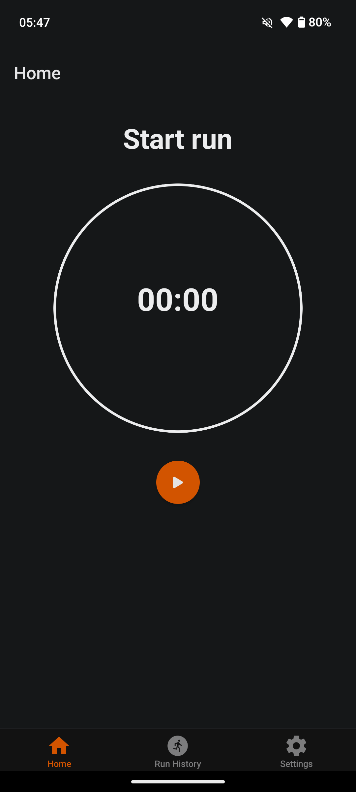
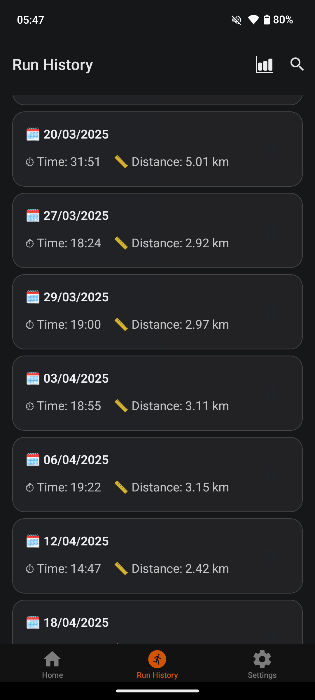
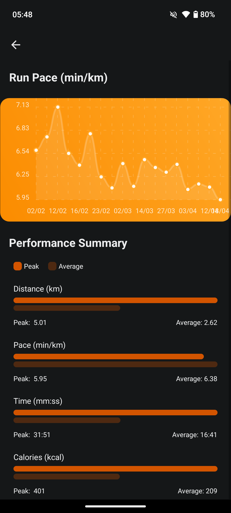

# RunIt

RunIt is an open-source app designed to track running and jogging metrics while prioritizing user privacy. Unlike many existing fitness tracking apps that compromise privacy, RunIt ensures that your data remains yours.


| |  |  |  |
| --- | --- | --- | --- |

---

## Get Started

1. Install dependencies:
   ```bash
   npm install
   ```

2. Start the app:
   ```bash
   npx expo start
   ```

You can run the app using:
- [Development build](https://docs.expo.dev/develop/development-builds/introduction/)
- [Android emulator](https://docs.expo.dev/workflow/android-studio-emulator/)
- [iOS simulator](https://docs.expo.dev/workflow/ios-simulator/)
- [Expo Go](https://expo.dev/go)


## Building from Source

You can build the app from source using the following commands:

- For a preview distribution build:
  ```bash
  npm run prev
  ```

- For a development build:
  ```bash
  npm run dev
  ```
